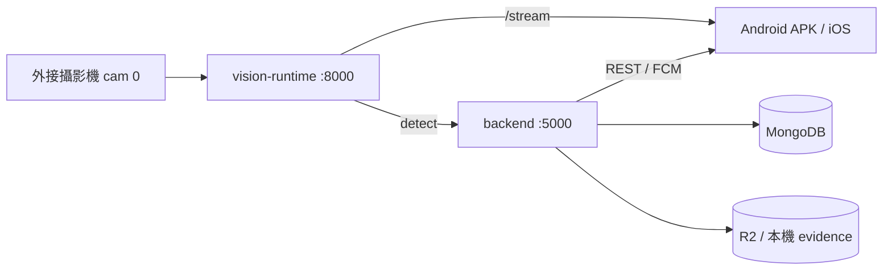
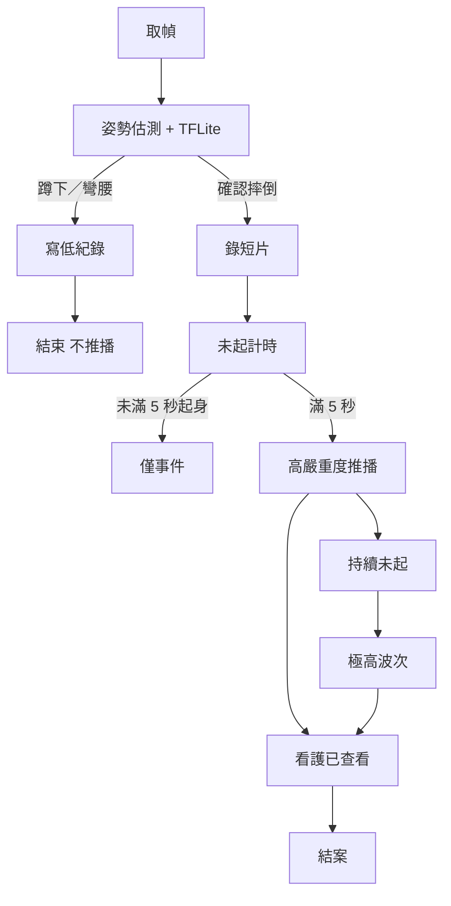
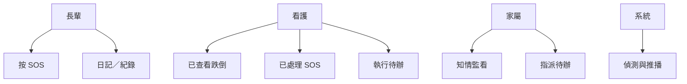

# TakeCare 居家跌倒偵測與遠距照護系統 — 系統文件書

> 依 `系統文件書格式.pdf`：摘要、緒論、相關技術、概要設計、工具與環境、實作與結果、結論、參考文獻。  
> 封面顏色依當年度系上規定。電子檔須含 GitHub 連結。原始碼完整上傳另議（本機目前**未要求 push**）。  
> 日期：2026-09-13

**GitHub（遠端）：** https://github.com/takecare-agent/MyApp.git  
**本機分支：** `vision-integration`

---

## 摘要

本專題實作 TakeCare，一套給居家長輩、看護與家屬共用的遠距照護系統。核心是以電腦外接攝影機做即時跌倒偵測，並把事件、待辦、血壓、緊急求救與跨語溝通接到同一支行動 App。偵測端使用自訓 TensorFlow Lite 模型（v8）搭配 MediaPipe 姿勢閘門，區分蹲下、彎腰與確認摔倒；確認摔倒且持續未起滿 5 秒才升級為需處理的高嚴重度通報，蹲下與彎腰只記錄不推播。行動端為 React Native（`mobile-expo`），後端為 Node.js，六語介面（繁中、英、印尼、越、菲、泰）。看護處理、家屬知情監看。目前已有可離線安裝的 Android Release APK；服務仍由本機後端與影像行程提供。

---

## 1. 緒論

### 1.1 背景介紹

高齡者居家跌倒是常見且後果嚴重的事故。商業監視器多半只提供連續畫面或通用移動偵測，無法區分「蹲下撿東西」與「摔倒起不來」，也缺少看護／家屬角色分工。本專題把「可信的跌倒事件」與「可操作的照護流程」做在同一產品裡。

### 1.2 專題的目的及重要性

目的是做出可在真機演示的系統：攝影機偵測、App 通報與結案、照護待辦、血壓與急救，並讓外籍看護能切換介面語言。重要性在於事件定義必須臨床上說得通：誤把蹲下當摔倒會造成警報疲勞，漏報未起則有安全風險。

### 1.3 主要研究問題或目標

1. 如何在僅有 fall／normal 的輕量模型上，用姿勢閘門分開蹲下、彎腰與摔倒？  
2. 如何定義高／極高，使「未起 5 秒」才通報，而不是高分蹲著 5 秒？  
3. 看護與家屬的權限如何符合「知情不處理」？  
4. 介面如何在六語下仍可讀、不被截斷？

### 1.4 系統功能簡介

| 模組 | 功能 |
|---|---|
| 跌倒偵測 | 即時串流、姿勢閘門、蹲下／彎腰僅記、摔倒短片 |
| 監看 | 即時、活動歷程、證據（截圖／短片） |
| 緊急 | 長輩 SOS、119、急救選答、看護已處理 |
| 待辦 | 家屬指派、看護回報、日常紀錄 |
| 血壓 | 手打與安卓 Health Connect（歐姆龍） |
| 訊息 | 照護圈聊天、語音訊息、口譯（語音引擎已凍結） |
| 帳號 | 三角色、照護圈綁定、六語 |

### 1.5 系統使用對象

- 受顧者（長輩）：大 SOS、日記／紀錄  
- 看護：待辦、監看處理、急救  
- 家屬：知情監看、指派待辦、血壓總覽（不結案跌倒）

### 1.6 系統特色

- Event ≠ Alert：低姿紀錄與跌倒通報分開  
- 角色權限分離  
- 本機影像、不上傳 24 小時連續影  
- 六語字典＋手打內容跨語  
- 安卓可裝 Release APK，不需 Metro  

---

## 2. 相關技術應用與重要文獻

| 技術／產品 | 優點 | 缺點 | 本專題取捨 |
|---|---|---|---|
| 一般 IP Cam（D-Link 等） | 畫面完整 | 無跌倒語意、警報吵 | 不抄馬賽克產品化 |
| 寵物／嬰兒監視（Furbo、Cubo） | 通知分群 | 場景不同 | 只借「緊急與日常分開」 |
| 雲端視覺 API | 省訓練 | 抹掉自訓差異、隱私差 | 不採用 |
| 浴室雷達（Vayyar） | 無影像隱私佳 | 硬體成本、非本階段 | 列未來 |
| MediaPipe Pose | 骨架即時、裝置可跑 | 需自訂閘門 | 採用，擋蹲／彎升級 |
| TFLite 跌倒分類 | 可離線、可口試 | v8 僅 fall／normal | 用狀態機補齊 |
| AHA／ACC 高血壓指引 | 居家血壓有依據 | 非診斷 | 血壓警戒 130/80 作參考 |
| Whisper 語音辨識 | 多語 STT | 資源重 | 已接入；**語音模組凍結** |

文獻取向上對齊護理呼叫（PERS）「未起才升級」與跌倒偵測常用的髖部下落、外框寬高比，而非單幀分類。

---

## 3. 系統概要設計

### 3.1 方法與技術

三層：影像服務（Python + TFLite + MediaPipe）→ 後端（Node、Mongo、FCM）→ 行動客戶端（React Native 0.81）。跌倒採狀態機：正常 → 疑似 → 確認摔倒 → 未起計時 → 高／極高推播。

**現成與自寫（口試必分清）**

| 現成 | 本專題自寫／自訓 |
|---|---|
| MediaPipe Pose：每幀 33 關節 | 30 幀滑動窗口、補零、何時推論 |
| Keras LSTM 層、TFLite 執行器 | 用 URFD＋Le2i＋自錄誤報訓練權重（v8） |
| OpenCV 開 USB 攝影機 | 鎖 cam 0、HTTP 包成 App 服務 |
| 公開跌倒影片（URFD、Le2i） | 姿勢閘門（蹲／彎／躺）、五態狀態機、未起 5 秒才推高 |

模型只輸出 fall／normal。蹲下不推播不是模型第四類，是關節規則擋升級。接 App 的是 **v8 TFLite**；v7 僅 Le2i AUC 較高，不接 App。過程見 `Fall_Detection_Lab/docs/PROJECT_JOURNAL.md`，講稿見 `GUIDE_跌倒辨識現成與自寫_口試_2026-09-13.md`。

### 3.2 工具選擇理由

- React Native bare：要原生血壓、通知、麥克風  
- 本機 vision-runtime：口試可展示自訓模型，資料不出門  
- Mongo + 物件儲存（Cloudflare R2 或本機 evidence）：metadata 與檔案分離  
- 六語自建字典：避免系統文案被當 UGC 機翻  

### 3.3 處理流程（跌倒）

1. 攝影機 cam 0 取 1920×1080。  
2. MediaPipe 估姿勢（現成）；緩衝 30 幀、每 5 幀跑 v8 TFLite，得 fall 機率。  
3. `classify_posture`（自寫）：stand／squat／bend／lie。髖夠低或倒地外框才躺；彎腰腿仍下垂≠躺。  
4. 狀態：IDLE → SUSPECTED → CONFIRMED／DISMISSED（另有 SUGGEST_DISMISS）。蹲／彎不得因高分或 5 秒變成摔倒。確認 Trigger：A 躺姿 1.5s、B 快速下落、C 躺地靜止。  
5. 蹲下／彎腰：寫低嚴重度紀錄＋截圖，不推播。  
6. CONFIRMED：短片＝綠 5s→紅＋後約 8s；後端未起 ≥5 秒才高嚴重度推播；持續未起極高波次 2／5／15／35 分。  
7. 看護一鍵已查看；家屬知情不處理。手機畫面無骨架；骨架只在 Mac 除錯窗。  

### 3.4 檔案關連

| 元件 | 主要路徑 |
|---|---|
| App | `mobile-expo/src/` |
| API | `backend/index.js` |
| 影像 | `vision-runtime/vision_api_server.py` |
| 語系 | `mobile-expo/src/i18n/catalogs.js` 等 |
| 需求歷程 | `Fall_Detection_Lab/docs/` |
| 安裝包 | `~/Desktop/TakeCare-demo/*.apk` |
| 證據檔 | R2 bucket `takecare-evidence`（或本機 `backend/data/evidence/`） |
| 抽象層 | `backend/lib/objectStore.js`（S3 相容） |

### 3.5 系統架構圖

手機不跑模型。Release APK 內含 JS，仍要連本機 5000（監看再連 8000 或經後端轉）。

### 3.6 流程圖

### 3.7 使用案例圖

使用案例摘要：長輩 SOS → 看護已處理；摔倒未起 → 看護已查看；家屬指派待辦；血壓同步；六語切換。

### 3.8 甘特圖（階段）

| 期間 | 工作 |
|---|---|
| 2026-07 前 | 模型 v7／v8、Lab 訓練 |
| 2026-08 | 角色、警報分級、SOS、i18n 骨架 |
| 2026-08 末 | 姿勢閘門、語音訊息、結案改口 |
| 2026-09 | 監看時間軸、血壓、六語、急救、離線 APK |

### 3.9 活動圖（看護處理摔倒）

推播到達 → 開監看／活動 → 看短片 → 按已查看（可選說明）→ 家屬側同步結案 → 極高波次停止。

---

## 4. 系統開發工具與使用環境

### 4.1 開發工具

| 項目 | 版本／備註 |
|---|---|
| Node.js | 20.x（腳本指定 20.20.2） |
| React Native | 0.81 bare（mobile-expo） |
| Python | 3.11 + vision-runtime `.venv` |
| 模型 | `fall_detection_model_v8.tflite` |
| 資料庫 | MongoDB |
| 建置 | Android Gradle 8.14、Xcode（iOS） |
| 除錯 | Metro 8081、adb |

### 4.2 運行環境

**伺服器（開發／演示用 Mac）**

- macOS，外接 USB 攝影機（cam 0）  
- 埠：後端 5000、影像 8000；開發 Reload 另開 8081  

**Android 客戶端**

- 安裝 `TakeCare-vision-integration.apk`  
- 與 Mac 同一熱點，伺服器填 `http://<Mac-IP>:5000`  
- 不需 Metro、可拔 USB  

**iOS**

- USB＋Xcode 裝開發版（2026-09-13 Zhen 已可開）  
- 與 Mac 同一熱點；開發 Reload 需 Metro  

測試帳號：`patient@test.com`、`caregiver@test.com`、`family@test.com`，密碼 `Test1234!`。

### 4.3 套件與資料（跌倒線）

**推論（`vision-runtime`）**：mediapipe 0.10.14、tensorflow 2.16.2（Interpreter）、opencv-python 4.10、numpy 1.26。  
**訓練（Lab `train_env`）**：TensorFlow／Keras 2.x、EarlyStopping；自寫 `augmentation.py`、`train_model_v8.py`。  
**權重檔**：`fall_detection_model_v8.tflite`（約 235 KB），架構 LSTM64→LSTM32→Dense16→sigmoid。輸入 `(30, 99)`＝33 點×3×30 幀。  
**資料**：URFD（早期，場景單一）；Le2i Fall Detection（多房間）；Block N 自錄誤報 16 支改標 normal 後重訓 v8。  
**產品層**：Express、mongoose、firebase-admin（FCM）、React Native 0.81。Whisper／語音管線已凍結，不列為本節貢獻。

---

## 5. 系統實作及實驗結果

### 5.1 功能實作摘要

已落地：三角色 App、照護圈、SOS 與急救選答、待辦與日常紀錄、血壓（安卓 Health Connect）、監看即時／活動／證據、六語、FCM、離線 APK。  
凍結：語音 STT／Whisper／錄音管線（用戶確認現況後鎖）。  
辨識幾何凍結：不改姿勢閘門公式，除非用戶說可以實測。

### 5.2 實驗與評估

發表／演示採用 **v8 TFLite＋姿勢閘門／狀態機**。v7 僅學術集 AUC 較高，**不接 App**。圖表在 `Fall_Detection_Lab/00_論文專題素材/02_圖表_混淆矩陣與ROC/`（優先 v8）。

| 項目 | 數字 | 備註 |
|---|---|---|
| Le2i hold-out AUC | v7 **0.9591**／v8 **0.8894** | n=335，@thr=0.50 |
| v8 自錄盲測 | Acc **78.05%**；Fall Recall **73.68%**（14/19）；F1≈0.76 | 41 支，@thr=0.55 |
| v8 test_extra FP | **3.32%**（n=361，@0.50） | Lecture/Office 日常 |
| 舊狀態機延遲 | mean 7.72／median 6.88s | 舊 Trigger A＝高分 5s；**現行確認躺＝1.5s，通報未起＝後端 5s** |
| 驗收裝置 | 真機兩台（華為安卓＋iPhone） | 不預設模擬器 |
| APK | 約 54 MB | `TakeCare-vision-integration.apk` |

狀態機執行時為五態：IDLE／SUSPECTED／CONFIRMED／SUGGEST_DISMISS／DISMISSED。歐姆龍同步 2026-09-12 用戶口述成功。限制：無大規模臨床試驗；演示用緩慢躺下、禁止真摔。

### 5.3 與相關技術比較

相對純監視器：有事件分級與角色。相對雲端 API：可離線推論、隱私較可控。相對單幀分類：有未起時間窗，降低蹲下誤報。

**物件儲存**：採 Cloudflare R2（S3 相容），相較 AWS S3 免除 egress 費用，適合家屬／看護頻繁瀏覽長輩紀錄的長照流量模式。透過 `objectStore.js` 抽象層，可無縫切換 MinIO、S3、GCS 等相容服務；App 仍經 backend 代理下載以保留 JWT 權限檢查。

**上傳資安**：以 `file-type` 檢查 buffer magic bytes，防止 MIME type spoofing（不信任前端 contentType）。

### 5.4 遭遇的問題和挑戰

1. v8 只有 fall／normal，必須靠 MediaPipe 閘門。軀幹水平曾把彎腰當躺，已撤回。  
2. iPhone 離熱點會載舊 JS，易被誤認功能消失。  
3. 六語長詞截斷、系統文案被當 UGC。  
4. 口譯曾因模型額度 429 不穩；語音已凍結。  
5. 清檔腳本曾誤刪舊語音 WAV，已禁止再刪使用者資料。  
6. Mac 對安卓不能像隨身碟拖檔，改用 `adb install -r`。

---

## 6. 結論及未來發展

### 6.1 主要貢獻

做出可演示的「偵測＋照護」閉環：自訓模型、姿勢閘門、角色權限、六語 App、可分發 APK。事件定義對齊居家照護而不是健身房動作詞。

### 6.2 未來工作

- iOS 血壓直連、正式 IPA／TestFlight  
- 官方翻譯 API＋術語表（口譯再解凍時）  
- 極高波次在重啟後的持久化  
- 使用者同意後的實機跌倒場景驗證  
- 封面依當年度顏色、五份紙本、iClass 上傳與助教 GitHub 連結  
- backend 代理下載改為 R2 簽名 URL 直讀，降低 backend 頻寬負擔  

### 6.3 接手與已知限制

- 三角色皆可註冊 FCM；背景顯示仍偏薄，深度睡眠／殺掉仍可能漏。  
- 照護圈 Membership 已落地，待多圈真機驗收。  
- 勿拆姿勢閘門去「只看 TFLite」；勿把 v7 權重接到 App。  
- 語音 9/12 凍結。換模型須重跑閾值與自錄盲測。  

預期挑戰：臨床樣本、推播在背景的穩定度、外籍用語持續校正。

---

## 7. 參考文獻

1. American Heart Association / American College of Cardiology, 2025 High Blood Pressure Guideline（居家血壓 130/80 參考，非診斷）.  
2. MediaPipe Pose, Google. https://developers.google.com/mediapipe  
3. TensorFlow Lite. https://www.tensorflow.org/lite  
4. React Native. https://reactnative.dev  
5. 本專題規格：`Fall_Detection_Lab/docs/SPEC_警報分級與異常事件_2026-08-05.md` 等。  
6. 需求總帳：`REQUIREMENTS_用戶對接總帳_2026-08-10.md`。  
7. 競品取捨：`RESEARCH_警報與攝影機UX_2026-08-10.md`。  
8. GitHub：https://github.com/takecare-agent/MyApp.git  
9. Kwolek, B. & Kepski, M. Human fall detection on embedded platform using depth maps and wireless accelerometer. URFD.  
10. Charfi, I. et al. Optimized spatio-temporal descriptors for real-time fall detection. Le2i Fall Detection Dataset.  
11. 本專題口試對照：`Fall_Detection_Lab/docs/GUIDE_跌倒辨識現成與自寫_口試_2026-09-13.md`。  

（紙本繳交時請依系上格式改為編號文獻體例，並補封面色。）
