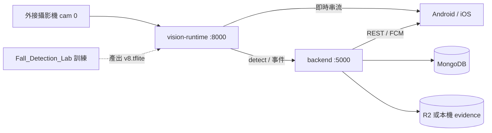
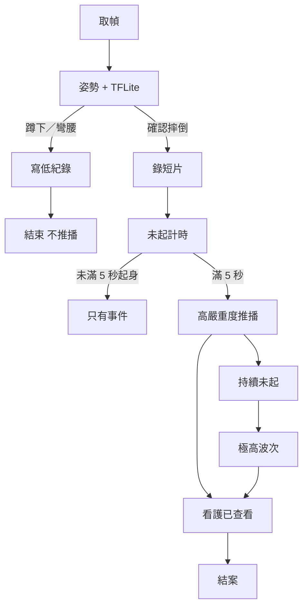
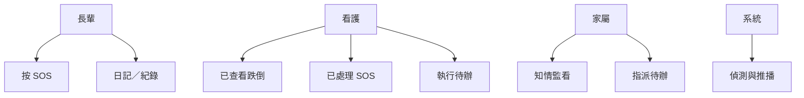
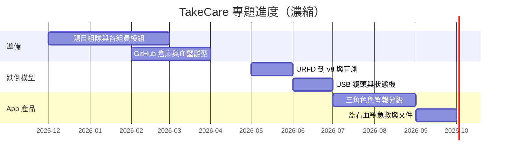
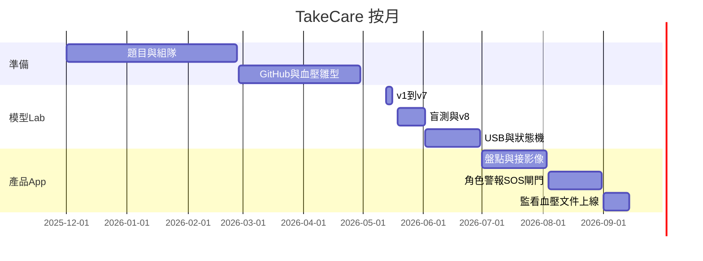

# TakeCare 居家跌倒偵測與遠距照護系統 — 系統文件書

> 依 `系統文件書格式.pdf`：摘要、緒論、相關技術、概要設計、工具與環境、實作與結果、結論、參考文獻。  
> **第 1～7 章**給繳交／口試。**第 8 章起**用白話寫給組員：功能、套件、怎麼跑、模型怎麼訓、數字怎麼來、哪一天做到哪。  
> 日期：2026-09-14

**GitHub：** https://github.com/takecare-agent/MyApp.git  
**組員請看分支：** `vision-integration`（不要看 `main`）  
**訓練與實驗本體（不在這個 Git 倉庫）：** 本機 `~/Desktop/Fall_Detection_Lab`

---

## 閱讀方式

| 你是誰 | 先看 |
|---|---|
| 組員（第一次看） | 第 8 章 → 第 11 章（怎麼跑）→ 第 9 章（App 有什麼） |
| 要講模型／數字 | 第 12 章 → 第 3.1、5.2 節 |
| 要畫時程／甘特 | 第 3.8 節（濃縮）＋ 第 13 章（按月） |
| 繳交紙本 | 第 1～7 章；封面顏色依當年度系上規定 |

兩套東西不要混：

| 名稱 | 在哪 | 做什麼 |
|---|---|---|
| **產品（TakeCare）** | `MyApp-main` | 手機 App、後端、攝影機服務。給人用。 |
| **實驗室（Lab）** | `Fall_Detection_Lab` | 下載影片、訓練模型、算 AUC、出圖。給研究與口試。 |

App **不**在手機上跑模型。模型在 Mac（或組員電腦）的 `vision-runtime` 跑完，再把結果告訴後端和 App。

---

## 摘要

本專題實作 TakeCare：居家長輩、看護、家屬共用的遠距照護系統。電腦外接攝影機做即時跌倒偵測，事件、待辦、血壓、緊急求救與六語介面接在同一支 App。

偵測端用自訓 TensorFlow Lite 模型（**v8**）加 MediaPipe 姿勢閘門，分開蹲下、彎腰與確認摔倒。確認摔倒且持續未起滿 5 秒才推「高」給看護／家屬；蹲下與彎腰只記不推。行動端 React Native（`mobile-expo`），後端 Node.js。看護可結案；家屬知情、不處理跌倒。

模型權重是我們用公開跌倒影片（URFD、Le2i）與自錄誤報片訓練的；骨架工具是 Google MediaPipe（現成）。接 App 的是 v8，不是學術集 AUC 最高的 v7。

---

## 1. 緒論

### 1.1 背景介紹

高齡者居家跌倒常見且後果嚴重。一般監視器多半只有連續畫面或移動偵測，分不出「蹲下撿東西」和「摔倒起不來」，也沒有看護／家屬的權限分工。本專題把「什麼才算跌倒事件」和「誰該被通知、誰可以結案」做在同一套系統。

### 1.2 專題的目的及重要性

目的：真機能演示——攝影機偵測、App 通報與結案、照護待辦、血壓、急救，外籍看護可切語言。

重要性：誤把蹲下當摔倒會吵到沒人理警報；漏掉起不來的人則有安全風險。所以產品規則必須講得清楚，不能只報一個「AI 準確率」。

### 1.3 主要研究問題或目標

1. 模型只有 fall／normal 兩類時，如何用姿勢規則分開蹲下、彎腰與摔倒？  
2. 「高」如何定義成「確認摔倒後未起滿 5 秒」，而不是「蹲著高分 5 秒」？  
3. 看護與家屬權限如何做到「家屬知情、不處理」？  
4. 六語介面如何仍可讀？

### 1.4 系統功能簡介

| 模組 | 誰用 | 做什麼 |
|---|---|---|
| 跌倒偵測 | 系統＋看護／家屬看結果 | 即時畫面、蹲／彎只記、摔倒短片、未起才推高 |
| 監看 | 看護、家屬 | 即時、活動歷程、截圖／短片 |
| 緊急 | 長輩按；看護處理 | SOS、119、急救選答 |
| 待辦 | 家屬指派；看護回報 | 今日待辦、完成圈、日常紀錄 |
| 血壓 | 家屬／長輩 | 手打；安卓可同步歐姆龍（Health Connect） |
| 訊息 | 照護圈 | 文字、語音訊息（語音辨識引擎目前凍結，不再改） |
| 帳號 | 三人 | 註冊／登入／Google、照護圈綁定、六語 |

完整畫面清單見第 9 章。

### 1.5 系統使用對象

- **受顧者（長輩）**：大 SOS、日記／紀錄、看自己的待辦  
- **看護**：待辦、監看、已查看跌倒、已處理 SOS、急救  
- **家屬**：知情監看、指派待辦、血壓總覽；**不能**結案跌倒

### 1.6 系統特色

- Event ≠ Alert：蹲下是紀錄，不是警報  
- 角色權限分離  
- 影像在本機跑，不上傳 24 小時連續影到雲端當 NVR  
- 六語系統文案是字典，不是把整頁拿去機翻  
- 安卓可裝 Release APK；開發期 iPhone／安卓用 Metro Reload

---

## 2. 相關技術應用與重要文獻

| 技術／產品 | 優點 | 缺點 | 本專題取捨 |
|---|---|---|---|
| 一般 IP Cam | 畫面完整 | 無跌倒語意 | 不抄成產品主軸 |
| 寵物／嬰兒監視 | 通知分群 | 場景不同 | 只借「緊急與日常分開」 |
| 雲端視覺 API | 不用自己訓 | 隱私、無法口試自訓過程 | 不採用 |
| 浴室雷達 | 無影像 | 硬體與時程 | 列未來 |
| MediaPipe Pose | 骨架即時 | 不會告訴你「這是摔倒」 | 用來抽關節；後面規則自寫 |
| TFLite LSTM | 可離線、檔小 | v8 只有兩類 | 用狀態機補蹲／彎／未起 |
| AHA／ACC 血壓指引 | 居家血壓有依據 | 非診斷 | 警戒參考 130/80 |
| Whisper | 多語聽打 | 重、不穩 | 已接過；**語音凍結** |

文獻取向上對齊護理呼叫（PERS）「未起才升級」，以及跌倒研究常用的髖部下落、外框寬高比，而不是單幀亂分類。公開資料集見第 7、12 章（URFD、Le2i）。

---

## 3. 系統概要設計

完整可貼稿（含表、文獻編號體例、SOS／回拉／待辦流程）：`docs/系統文件書_第3至7章補稿_2026-09-14.md`。

### 3.1 方法與技術

本專題採**需求驅動的迭代開發**（總帳 R 編號 → 實作 → 真機／curl 驗收 → 入檔），並以**可重跑實驗鏈**支撐跌倒模組。系統分三層：

1. **影像服務**（Python：OpenCV 取像 ＋ MediaPipe 骨架 ＋ v8 TFLite ＋ 自寫姿勢閘門與狀態機）埠 **8000**  
2. **後端**（Node.js、MongoDB、FCM、物件儲存代理）埠 **5000**  
3. **手機**（React Native 0.81.5，`mobile-expo` bare）開發時 Metro 埠 **8081**

跌倒產品狀態：正常 → 疑似 → 確認摔倒 → 後端未起計時 → 高／極高推播。訓練在 Lab 離線完成；日常開 App **不必**開 Lab。

**現成與自寫（口試必分清）**

| 現成 | 本專題自寫／自訓 |
|---|---|
| MediaPipe：每幀 33 個關節 | 30 幀滑動窗口、推論步長 5、標籤規則 |
| Keras LSTM 層、TFLite 執行器 | URFD＋Le2i＋自錄誤報訓練的 **v8 權重** |
| OpenCV 開 USB 攝影機 | 鎖 cam **0**、HTTP `/stream` `/playback` 給 App |
| 公開跌倒影片 | 姿勢閘門、五態狀態機、未起 5 秒才推高 |

模型只輸出 fall／normal。蹲下不推播**不是**模型第四類。接 App 的是 **v8**（家里少誤報）；v7 只在 Le2i 學術集最好，不接產品。固定測試集 `test.npz` n=335、SEED=42。過程原文：`Fall_Detection_Lab/docs/PROJECT_JOURNAL.md`。

照護側方法：JWT／Google 登入；三角色權限；事件短片與語音經後端物件儲存；**24h 回拉 JPEG 留在攝影機電腦、不上雲**；六語系統文案為字典；SOS 對齊 PERS（聯絡人預先在帳戶、一按即送）。

### 3.2 工具選擇理由

| 選用 | 理由 | 不選 |
|---|---|---|
| React Native bare | 一碼雙端；血壓、FCM、麥克、定位要原生 | 純網頁拿不到健康／推播 |
| Node.js＋Express | 與 App 同 JS 生態，REST 好接 | 不另養 Java／Python 後端 |
| MongoDB | 事件／警報結構常變 | — |
| MediaPipe Pose | 即時離線骨架；口試能分清「骨架≠摔倒」 | 雲端視覺 API（隱私、無法自訓） |
| LSTM→TFLite（約 235 KB） | 本機時序推論 | 單幀 CNN；雲端大模型 |
| 本機 vision-runtime | 畫面不出門；回拉留電腦 | 雲端 NVR |
| FCM | 跨 iOS／Android 推播 | 簡訊／電話非 MVP |
| R2（S3 API） | 事件檔不全部堆本機；App 不直連 | 連續雲端錄影 |
| 自建六語字典 | 按鈕字不可當使用者內容去翻 | 全句丟翻譯 API |

浴室雷達列未來（硬體時程）。語音 Whisper 已接過、**現凍結**。

### 3.3 處理流程

**跌倒：** cam 0 取 1920×1080 → MediaPipe → 30 幀緩衝、每 5 幀 v8 → `classify_posture`（stand／squat／bend／lie；彎腰腿垂 ≠ 躺）→ IDLE／SUSPECTED／CONFIRMED。蹲／彎：低紀錄、不推播。CONFIRMED：存短片（紅前約 5s＋紅後約 8s）→ 後端未起 ≥5s 才推高 → 極高 2／5／15／35 分 → 看護「已查看」。手機不畫骨架。

**SOS：** 一鍵送出（約 10s 可取消）→ 照護圈預設聯絡人 → 看護「已處理」。不自動 119。

**監看：** 即時 `GET /stream`；回拉本機 JPEG 環，有檔才上色、跳秒順播；活動短片走證據儲存，與 24h 回拉分開。

**待辦：** 指派寫 Mongo → 執行回報；不與跌倒結案混帳。

**訓練（不上線日常）：** 影片→npy 窗→npz→增強→LSTM→掃閾值→學術圖＋41 支盲測→通過才拷 `fall_detection_model_v8.tflite`。

### 3.4 檔案關連

兩個根目錄：產品 `MyApp-main`（GitHub）；訓練與圖 `Fall_Detection_Lab`（本機，不在此 repo）。

| 元件 | 路徑 |
|---|---|
| App | `mobile-expo/src/`（語系 `i18n/catalogs.js`） |
| API | `backend/index.js`；設定 `backend/.env`（不提交） |
| 物件儲存 | `backend/lib/objectStore.js`；本機 `backend/data/evidence/` 或 R2 |
| 影像服務 | `vision-runtime/vision_api_server.py` |
| 回拉 | `vision-runtime/playback_store.py`、`data/playback_ring/` |
| 事件環 | `vision-runtime/evidence_ring.py` |
| 現行權重 | `vision-runtime/fall_detection_model_v8.tflite` |
| 開鏡頭 | `vision-runtime/start-cam.sh`（cam 0） |
| 需求／實驗 | Lab `docs/REQUIREMENTS_*`、`PROJECT_JOURNAL.md`、`DESIGN_*` |
| 訓練與圖 | Lab `工作區/`、`00_論文專題素材/02_圖表_混淆矩陣與ROC/` |
| 早期網頁 | `frontend/`（非正式手機版） |

資料流：USB cam 0 → vision :8000 →（JPEG 回拉本機｜短片經後端｜`/vision/report`）→ Mongo＋FCM → App；App 另拉 `:5000` REST 與 `:8000/stream`。Lab 訓完 tflite **拷貝**進 vision-runtime（虛線，非執行時相依）。

### 3.5 系統架構圖



箭頭「虛線」：Lab 訓完模型，把檔案拷進 `vision-runtime`。日常開 App **不必**開 Lab。

### 3.6 流程圖



### 3.7 使用案例圖



### 3.8 甘特圖（階段濃縮）

詳細按月見第 13 章。版本庫可查的最早日期是 **2026-02-27**。題目與組隊依組員說明約自 **2025 年底**。



| 期間 | 工作 |
|---|---|
| 2025-12～2026-02 | 題目、組隊、各人模組（血壓、Care AI 等） |
| 2026-02～03 | GitHub `MyApp`、血壓趨勢、早期網頁／分資料夾 |
| 2026-05 | 跌倒 v1→v7（Le2i、增強、標注） |
| 2026-05-19～06 | 自錄盲測、v8、USB 鏡頭、狀態機 |
| 2026-07 | 盤點 mobile-expo；影像接產品 |
| 2026-08 | 角色、警報、SOS、六語、姿勢閘門（8/30） |
| 2026-09 | 監看時間軸、血壓、急救、系統文件、推 `vision-integration` |

### 3.9 活動圖（看護處理摔倒）

推播到達 → 開監看或活動 → 看短片 → 按已查看（說明可選）→ 家屬側同步結案 → 極高波次停止。

---

## 4. 系統開發工具與使用環境

### 4.1 開發工具

| 項目 | 版本／備註 |
|---|---|
| 電腦（主開發） | macOS，Apple Silicon |
| Node.js | 20.x |
| React Native | 0.81 bare（`mobile-expo`） |
| Python 推論 | 3.10～3.12，`vision-runtime/.venv` |
| Python 訓練 | Lab `train_env`（3.9 + 完整 TensorFlow） |
| 模型 | `fall_detection_model_v8.tflite`（約 235 KB） |
| 資料庫 | MongoDB（本機 `takecare`） |
| 建置 | Android Gradle；Xcode（僅 Mac 能編 iOS） |
| 除錯 | Metro 8081、adb |

### 4.2 運行環境

| 項目 | 要求 |
|---|---|
| 主機 OS | macOS Apple Silicon（主開發）；Windows 可編安卓、**不能編 iOS** |
| Node.js | 20.x |
| Python 推論 | 3.10～3.12，`vision-runtime/.venv`（mediapipe 0.10.14、TF 2.16.2、OpenCV 4.10） |
| Python 訓練 | Lab `train_env`：3.9＋完整 TensorFlow（演示可不開） |
| 資料庫 | MongoDB `mongodb://127.0.0.1:27017/takecare` |
| 埠 | 後端 **5000**、影像 **8000**、Metro **8081** |
| 攝影機 | USB 外接 **cam 0**（勿用內建 1、手機連鏡 2） |
| 手機 | Android（血壓需 Health Connect）；iOS 真機須與 Mac **同一熱點** |
| 安卓 USB | `adb reverse` 8081／5000／8000 |
| `.env` | `MONGO_URI`、`JWT_SECRET`、`VISION_SHARED_TOKEN`（與鏡頭一致）；R2 可選 |

**測試帳**（密碼皆 `Test1234!`）：patient@test.com、caregiver@test.com、family@test.com。

限制：家用 Wi-Fi 開 AP isolation 時 iPhone 連不到 8081（改用熱點）。離開熱點會載手機內建舊 JS。未設 SMTP 則驗證信寄不出。語音凍結。未說可以實測前勿真摔。Archive 舊 APK 禁止安裝。

### 4.3 套件與資料（濃縮）

完整表見第 10 章。

**推論：** mediapipe 0.10.14、tensorflow 2.16.2、opencv-python 4.10、numpy 1.26。  
**訓練：** TensorFlow／Keras 2.x、EarlyStopping；自寫 `augmentation.py`、`train_model_v8.py`。  
**權重：** LSTM64→LSTM32→Dense16→sigmoid；輸入 `(30, 99)`＝33 點×3×30 幀。  
**資料：** URFD（早期、場景單一）；Le2i（多房間）；16 支自錄誤報改標 normal 後重訓 v8。  
**產品：** Express、mongoose、firebase-admin、React Native 0.81。

---

## 5. 系統實作及實驗結果

### 5.1 功能實作摘要

已落地：三角色、照護圈、SOS 與急救選答、待辦與日常紀錄、血壓（安卓 Health Connect）、監看即時／活動／證據、六語、FCM、登入整理、看護待辦圈、照護圈經歷、App 圖示。

凍結：語音 STT／Whisper／錄音管線。  
辨識幾何凍結：不改姿勢公式，除非說可以實測。

限制：Gmail 驗證碼需 SMTP／應用程式密碼才寄得出；沒設就用測試帳或 Google 登入。

### 5.2 實驗與評估

兩軸不可混：學術＝窗口級固定 `test.npz` n=335（fall 48／normal 287）；家里＝影片級 41 支（19 跌倒／22 日常，閾值 0.55）。發表／演示用 **v8 TFLite＋姿勢閘門**。圖：`00_論文專題素材/02_圖表_混淆矩陣與ROC/`（優先 v8）。完整表見補稿第 6 節。

| 版 | Le2i AUC | 家里 Acc（n=41） | 家里 FP | 決策 |
|---|---|---|---|---|
| v1 只 URFD | 0.5495 | — | — | baseline（近似亂猜） |
| v2 | 0.9464 | — | — | 過程 |
| v4 | 0.9426 | — | — | 一度主力 |
| **v7** | **0.9591** | 56.10% | 16 | 學術最好，**不接 App** |
| **v8** | **0.8894** | **78.05%** | **4** | **接 App** |

v8 盲測 Fall Recall＝14/19＝73.68%；extra FP @0.50＝3.32%（n=361）。AUC 下降是 domain adaptation（16 支自家誤報當 normal），不是算錯。舊狀態機高分 5s 延遲 mean 7.72s **不是**現行規則；現行確認躺約 1.5s、高＝後端未起 5s。無臨床試驗。驗收：真機兩台。演示緩慢躺下，禁止真摔。

### 5.3 與相關技術比較

相對純監視器：有分級與角色。相對雲端 API：可離線推論。相對單幀分類：有未起時間窗，蹲下比較不會直接變警報。

檔案用 Cloudflare R2 或本機；上傳用 magic bytes 檢查，不信任前端自稱的檔案類型。

### 5.4 遭遇的問題和挑戰

1. v8 只有兩類，必須靠閘門。曾把「軀幹水平」當躺，彎腰被誤判，已撤回。  
2. iPhone 離開與 Mac 同一熱點會載手機裡舊 JS，看起來像功能消失。  
3. 六語長詞截斷。  
4. 口譯曾因額度不穩；語音已凍結。  
5. Lecture/Office 當初整支當 normal，裡面其實有跌倒，數字會歪；後來人工標 7 支。  
6. v5 對困難負樣本 oversampling，真摔特徵被壓，不升主力。

---

## 6. 結論及未來發展

### 6.1 主要貢獻

可演示的「偵測＋照護」閉環：自訓權重、姿勢閘門、角色權限、六語 App。事件定義對齊居家照護，不是健身房動作分類。有完整實驗日誌與可重跑腳本，不是只有一個權重檔。

### 6.2 未來工作

- iOS 血壓直連、正式 IPA  
- 口譯解凍時接正式翻譯與術語表  
- 極高波次在後端重啟後仍要記得  
- 使用者同意後的實機場景驗證  
- 依系上規定繳封面、紙本、iClass  

### 6.3 接手與已知限制

- 勿把 v7 權重接到 App  
- 勿拆掉姿勢閘門只看 TFLite 分數  
- 語音 9/12 起凍結  
- 換模型必須重跑閾值與 41 支盲測  
- 推播在手機被殺掉時仍可能漏  

---

## 7. 參考文獻

完整 APA 體與 DOI 見 `docs/系統文件書_第3至7章補稿_2026-09-14.md` 第 7 節。紙本請改系上編號並補封面色。

1. Kwolek, B., & Kepski, M. (2014). Human fall detection on embedded platform using depth maps and wireless accelerometer. *Computer Methods and Programs in Biomedicine, 117*(3), 489–501. https://doi.org/10.1016/j.cmpb.2014.09.005（URFD）  
2. Charfi, I., Miteran, J., Dubois, J., Atri, M., & Tourki, R. (2013). Optimized spatio-temporal descriptors for real-time fall detection. *Journal of Electronic Imaging, 22*(4), 041106. https://doi.org/10.1117/1.JEI.22.4.041106（Le2i）  
3. Igual, R., Medrano, C., & Plaza, I. (2013). Challenges, issues and trends in fall detection systems. *BioMedical Engineering OnLine, 12*, 66.  
4. Lugaresi, C., et al. (2019). MediaPipe: A framework for building perception pipelines. *arXiv:1906.08172*.  
5. Bazarevsky, V., et al. (2020). BlazePose: On-device real-time body pose tracking. *arXiv:2006.10204*.  
6. Hochreiter, S., & Schmidhuber, J. (1997). Long short-term memory. *Neural Computation, 9*(8), 1735–1780.  
7. Abadi, M., et al. (2016). TensorFlow: A system for large-scale machine learning. *OSDI 16*.  
8. TensorFlow Lite. https://www.tensorflow.org/lite  
9. React Native. https://reactnative.dev  
10. Firebase Cloud Messaging. https://firebase.google.com/docs/cloud-messaging  
11. Radford, A., et al. (2023). Robust speech recognition via large-scale weak supervision. *ICML*.  
12. Jones, D. W., et al. (2025). 2025 AHA/ACC Guideline for the Prevention, Detection, Evaluation, and Management of High Blood Pressure in Adults. *Circulation*.  
13. ImmeCare. PERS alarm escalation workflow. https://www.immecare.com/pers-alarm-escalation-workflow/  
14. 本專題：`PROJECT_JOURNAL.md`、`DESIGN_影像辨識脈絡與佐證路徑_2026-09-13.md`、`REQUIREMENTS_用戶對接總帳_2026-08-10.md`、`SPEC_警報分級與異常事件_2026-08-05.md`  
15. GitHub：https://github.com/takecare-agent/MyApp/tree/vision-integration

---

## 8. 白話說明（給組員）

### 8.1 這套系統在幹嘛

房間裡有一支接到電腦的攝影機。電腦一直看畫面裡的人：

- 只是蹲下、彎腰 → 記一筆，**手機不叫**  
- 確認摔倒，且躺著超過 5 秒沒起來 → 看護和家屬手機跳出跌倒通報  
- 長輩按 SOS → 看護要按「已處理」  
- 家屬可以看畫面、派待辦、看血壓，但不能把跌倒標成已處理  

### 8.2 「模型」到底是哪一塊

不要說「我們發明了跌倒 AI」。比較準的說法：

1. Google 的 MediaPipe 從畫面算出頭、肩、髖、膝等 **33 個點**。這不是我們寫的。  
2. 我們把大約 1 秒多（30 張畫面）的這些點，丟進自己訓練的小網路，問：「這段比較像跌倒還是日常？」答案只有兩種。  
3. 我們自己寫規則：看起來像蹲，就不准變成摔倒警報。  
4. 後端再數：摔倒之後有沒有滿 5 秒還沒站起來。滿了才推「高」。

所以：**骨架現成、網路結構現成、權重我們訓、產品規則我們定。**

### 8.3 為什麼有兩個資料夾

| 資料夾 | 組員要不要 clone |
|---|---|
| `MyApp-main`（GitHub 這個） | **要。** 跑 App、後端、攝影機服務。 |
| `Fall_Detection_Lab`（目前在開發者本機 Desktop） | 要重訓模型、重出混淆矩陣才需要。日常看 App **不用**。 |

`vision-runtime/_experiments/` 是舊實驗，不是現在接 App 的服務。

### 8.4 數字不要講錯

- 「AUC 0.96」是 **v7** 在國外 Le2i 測試集。  
- App 用的是 **v8**，同一測試集 AUC 約 **0.89**，家裡 41 支片約 **78%**。  
- 不要只講一個 95%。教授會問分母。

---

## 9. App 裡面有哪些功能

底欄五格：首頁、待辦、監看、訊息、設定。角色不同，格子裡的內容不同。

### 9.1 三人都會用

| 功能 | 說明 |
|---|---|
| 登入／註冊 | 信箱＋密碼；Google。登入頁有雙手托屋標誌 |
| 六語 | 繁中、英、印尼、越、菲、泰 |
| 個人資料 | 姓名等；看護可填經歷／專長 |
| 照護圈 | 邀請碼綁定長輩－看護－家屬 |
| 訊息 | 圈內聊天；點頭像可看對方經歷（同圈） |
| 設定 | 資料、語言、圈；規劃中的假入口已拿掉 |

### 9.2 受顧者

| 功能 | 說明 |
|---|---|
| SOS | 大按鈕求救；看護結案叫「已處理」 |
| 日記／心情 | 當日紀錄 |
| 今日待辦 | 看家屬／看護排的事（長輩不是主派單人） |
| 短語 | 常用句 |

### 9.3 看護

| 功能 | 說明 |
|---|---|
| 首頁待辦圈 | 分子＝已完成、分母＝今日全部（含已完成） |
| 待辦回報 | 點進才回報；完成後進完成紀錄 |
| 監看 | 即時、活動列、回放、證據 |
| 跌倒大卡 | 與 SOS 同一套底部大卡；按「已查看」 |
| 急救 | 選答指引（哈姆立克等） |

### 9.4 家屬

| 功能 | 說明 |
|---|---|
| 指派待辦 | 給看護做 |
| 監看 | 知情；**沒有**已查看／已處理 |
| 血壓總覽 | 手打與安卓同步 |
| 活動／統計 | 看期間內事件，不結案跌倒 |

### 9.5 有做過、但現在不要改的

- 語音聽打、口譯、Whisper  
- 姿勢閘門公式（未說可以實測前）

### 9.6 不做（已拍板）

馬賽克產品化、浴室雷達、雲端視覺 API、寵物功能牆、把蹲下拿去推播。

---

## 10. 安裝過的套件（用途）

只列「為什麼裝」，版本以各目錄 `package.json`／`requirements.txt` 為準。

### 10.1 手機 `mobile-expo`

| 套件 | 用途 |
|---|---|
| react、react-native 0.81 | App 本體 |
| @react-native-async-storage/async-storage | 記住登入 |
| @react-native-firebase/app、messaging | 推播 |
| @react-native-google-signin/google-signin | Google 登入 |
| @invertase/react-native-apple-authentication | Apple（登入頁目前未放按鈕） |
| @react-native-community/geolocation | 定位（SOS 等；跌倒卡不顯示客廳） |
| react-native-health-connect | 安卓讀歐姆龍血壓 |
| react-native-webview | Google 登入頁 |
| socket.io-client | 即時連線 |
| react-native-vector-icons | 圖示 |
| @react-native-voice/voice、react-native-tts | 語音／朗讀（相關功能凍結） |

開發：Metro、Babel、React Native CLI。

### 10.2 後端 `backend`

| 套件 | 用途 |
|---|---|
| express | HTTP API |
| mongoose | MongoDB |
| jsonwebtoken、jose、bcryptjs | 登入憑證、密碼 |
| firebase-admin | FCM |
| passport、passport-google-oauth20、google-auth-library | Google |
| nodemailer | 驗證信（要設 SMTP） |
| @aws-sdk/client-s3 | R2／S3 相容物件儲存 |
| file-type | 上傳檔頭檢查 |
| socket.io | 即時 |
| axios、cors、dotenv、express-session | 請求、跨域、設定 |
| @xenova/transformers | Whisper（凍結，啟動仍會載） |
| @google/generative-ai、google-translate-api-x | 翻譯／生成（口譯線；凍結期間不當新功能） |

### 10.3 影像服務 `vision-runtime`

| 套件 | 用途 |
|---|---|
| opencv-python | 開攝影機、讀幀 |
| mediapipe | 33 關節 |
| tensorflow | 跑 TFLite |
| numpy、protobuf | 陣列與套件相容 |
| requests | 呼叫後端 |

### 10.4 訓練（只在 Lab，不在 GitHub 這個 repo）

完整 TensorFlow／Keras、sklearn（早期自動 class_weight）、自寫增強與切資料腳本。推論環境不要亂升 protobuf，會和 MediaPipe 打架。

---

## 11. 兩套系統怎麼執行

### 11.1 日常演示（產品）— 三個終端

順序固定。影像沒開，App 其他功能仍可用；監看即時會沒畫面。

**1. 後端**

```
cd MyApp-main/backend
# 若沒有 .env：複製 .env.example 為 .env，至少填 MONGO_URI、JWT_SECRET
npm ci
node index.js
```

等到 `Backend running`。有載 Whisper 時還要等 `[whisper] ready`。

**2. Metro（開發 Reload 才需要）**

```
cd MyApp-main/mobile-expo
npm ci
node scripts/run-metro.js
```

`http://127.0.0.1:8081/status` 應回 `packager-status:running`。

**3. 攝影機（要測跌倒才開）**

```
cd MyApp-main/vision-runtime
# Mac
source .venv/bin/activate
python vision_api_server.py
```

Windows 用目錄裡的 `setup-windows.ps1`、`start-windows.ps1`，不要打 `source .venv/bin/activate`。

外接鏡頭編號 **0**。安卓 USB：

```
adb reverse tcp:8081 tcp:8081
adb reverse tcp:5000 tcp:5000
adb reverse tcp:8000 tcp:8000
```

iPhone：跟跑後端的那台電腦同一熱點。電腦離開熱點，iPhone 會跑手機裡舊畫面。

**不要**用 `npx react-native start`、不要亂 `--reset-cache`。8081 掛掉時不要叫人滑掉 App 重開——會載到舊包。

### 11.2 訓練／重出數字（Lab）— 平常不必跑

```
cd ~/Desktop/Fall_Detection_Lab
source train_env/bin/activate    # 訓練
# 或
source infer_env/bin/activate    # 轉資料、即時腳本
```

訓練產出的 `.h5`／`.tflite` 在 `工作區/`。要接到 App，把 `fall_detection_model_v8.tflite` 與 `thresholds_v8.json` 拷到 `MyApp-main/vision-runtime/`。

沒有說「可以重訓／可以實測」之前，不要改閘門、不要換 v7 進 App。

### 11.3 組員 Windows 最短路徑

1. `git fetch` → `git checkout vision-integration` → `git pull`  
2. 裝 Node 20、MongoDB、Android Studio  
3. 照 11.1 開後端＋Metro  
4. USB 接安卓，三行 `adb reverse`，Android Studio 開 `mobile-expo/android`  
5. 測試帳登入  

影像先做不到不要卡住：App 登入、待辦、聊天可以先看。

---

## 12. 模型：用什麼、經過什麼、產出什麼、怎麼佐證

### 12.1 一句流程

```
公開／自錄影片
  → MediaPipe 抽骨架
  → 切 30 幀窗口，標 fall=1 或 normal=0
  → 分成 train / val / test（test 固定 SEED=42，後來每版都比同一份）
  → 左右翻、時間微扭曲、座標加雜訊（augmentation）
  → LSTM 訓練，EarlyStopping，class_weight 後來固定 normal:fall = 1:3
  → 存 best_*.h5
  → 轉成 *.tflite（約 235 KB）
  → 掃閾值 0.30～0.70
  → 學術集：混淆矩陣、ROC、AUC
  → 家裡：41 支盲測（人先標、模型再猜）
  → 眼睛看骨架＋機率條（質性）
  → 接 App 後再用狀態機／閘門（這層不是再訓一版網路）
```

### 12.2 資料從哪來

| 來源 | 是什麼 | 我們做了什麼 |
|---|---|---|
| URFD | 國外、幾乎一房一人 | 早期唯一資料；當測試會漏題，後來不當測試集 |
| Le2i | Kaggle 約 9.37 GB；Home／Coffee 有幀標注 | 刪 PNG、留 avi、轉 npy；Lecture／Office 後來才處理標籤 |
| 自錄 41 支 | 自己家裡蹲、坐、趴、擦地、躺 | `my_secret_labels.csv` 先標再算；這叫盲測 |
| 16 支誤報 | 盲測裡 v7 會亂叫的日常 | 當 normal 加進 v8 訓練 |

### 12.3 各版為什麼留或丟

架構幾乎同一條。差在資料與後面規則。

| 版 | 約何時 | 做了什麼 | 結果 | 現在 |
|---|---|---|---|---|
| v1 | 最早／5/13 才正式量 | 只 URFD | Le2i AUC≈0.55，近似亂猜 | 棄，當 baseline |
| v2 | 5/13 | ＋Le2i、增強、自動加權 | AUC 0.9464 | 過程 |
| v3 | 5/13 | ＋無標注房間當 normal | 學術退、誤報有降 | 不留主力 |
| v4 | 5/14 | 手動 1:3、hard negative | AUC 0.94 | 一度主力 |
| v5 | 5/14 | 困難片 oversampling | 真摔被壓 | **不升** |
| v6 | 5/15 | 只清假 normal | 不夠 | **不升** |
| v7 | 5/15 | 7 支精確跌倒幀＋乾淨 extra | **AUC 0.9591 最好** | 學術備用，**不接 App** |
| v8 | 5/19 | ＋16 支自家 FP | 家里 Acc 56%→78% | **接 App** |

2026-08-30：實測蹲著會紅 → **不重訓**，加姿勢閘門；「5 秒」改成確認後未起。

### 12.4 產出檔（佐證時指這些）

| 種類 | 放哪 |
|---|---|
| 權重 | `工作區/best_fall_detection_model_v8.h5`、`fall_detection_model_v8.tflite` |
| 閾值 | `thresholds_v8.json` |
| 學術圖 | `00_論文專題素材/02_圖表_混淆矩陣與ROC/v8_confusion_matrix.png`、`v8_roc_curve.png` |
| 盲測圖 | `v8_blind_confusion_matrix.png`；對照 v7：`blind_test_report.txt` |
| 切好的資料 | `工作區/train.npz` `val.npz` `test.npz` |
| 腳本 | `prepare_v8_dataset.py` `train_model_v8.py` `evaluate_v8.py` `export_tflite_v8.py` |
| 日誌 | `docs/PROJECT_JOURNAL.md`（只追加、不改舊文） |
| App 執行檔 | `MyApp-main/vision-runtime/vision_api_server.py` |

口試投影片優先用 `00_論文專題素材` 那套圖，不要和 Archive 舊檔對不上版。

### 12.5 怎麼證明「不是亂報數字」

1. **同一測試集：** Le2i Home/Coffee hold-out `test.npz`，n=335（fall 48、normal 287），SEED=42。每版都比這份。  
2. **AUC 不吃單一閾值；** 表格若寫 @0.50 要講出來。  
3. **家里另算：** 41 支影片級，閾值 0.55，標籤事先寫在 csv。  
4. **質性：** `video_visualize` 看骨架和機率條，才發現無標注房間會全誤報。  
5. **棄版有理由：** v5／v6 寫在期刊／口試是貢獻，不是遮羞。  
6. **產品層：** 用測試帳走一次蹲下（應不推）與緩慢躺下（滿 5 秒才高）。未說可以實測前不要催鏡頭。

指標定義：Accuracy＝全對／全部；Fall Recall＝真摔有抓到幾成；AUC＝ROC 下面積。漏報比誤報貴，所以早期閾值偏低；家里誤報太多之後，改用規則擋蹲，而不是把閾值亂調到不能用。

---

## 13. 詳細甘特圖（2025 年底～2026-09）

日期能對到 commit、JOURNAL、總帳的就寫死；2025 年底依組員說明，倉庫裡還沒有檔。

| 期間 | 進度 | 產出／佐證 |
|---|---|---|
| 2025-12～2026-01 | 題目發想、組隊、分工方向（跌倒影像＋照護 App） | 口頭／課程時程；無 Git |
| 2026-02-27～03 | GitHub `MyApp` 成立；血壓計、Care AI、各組員資料夾合併 | commit：藍芽血壓計、趨勢圖、first commit |
| 2026-03～04 | 早期網頁 `frontend`、各人功能並行；尚未定 mobile-expo 為唯一客戶端 | 倉庫 `frontend/` |
| 2026-05-13 | Lab 正式日誌開始。Le2i 下載、v1 baseline（AUC 0.55）、v2 跨資料集＋增強 | JOURNAL Block A–E；v2 圖 |
| 2026-05-14 | v3～v5；發現 Lecture/Office 標籤問題；推論步長改 5 | Block F–J |
| 2026-05-15～16 | 清污染、v6 不升、v7 學術最好、鏡頭初測 | Block K–M；`thresholds_v7.json` |
| 2026-05-19 | 41 支盲測；v8 domain adaptation | Block N–O；盲測報告 |
| 2026-06-02 | USB 外接鏡；v8 升主力＋狀態機（當時 Trigger A 仍是高分 5 秒） | Block P |
| 2026-06-17 | 家裡實拍骨架截圖 | `00_論文專題素材/06_實測截圖_2026-06-17/` |
| 2026-07-29 | App 完整度盤點；影像研究摘要 | `AUDIT_mobile-expo`、`RESEARCH_2026-07-29` |
| 2026-08-04～10 | 三角色、警報規格、需求總帳、驗收流程 | SPEC 警報／角色；總帳開帳 |
| 2026-08-13～23 | 帳號、照護圈、跨語、SOS、急救選答規格 | 多份 SPEC |
| 2026-08-29 | 看護結案改「已查看」；聊天語音規格 | R03、R100 |
| 2026-08-30 | 蹲／彎閘門；確認躺 1.5s；高＝未起 5s | JOURNAL 8/30；R04、R05、R108 |
| 2026-09-01～03 | 證據規則、活動帳本、時間軸方向 | R101–R117；CHECKPOINT |
| 2026-09-10～12 | 六語、聊天鍵盤、歐姆龍同步、語音凍結、真機兩台 | CHECKPOINT 語音凍結 |
| 2026-09-13 | 跌倒大卡、系統文件初版、R2 文件 | 本文件初稿 |
| 2026-09-14 | 登入整理、待辦圈、經歷、圖示；**推 GitHub `vision-integration`** | commit `754b6fc` |



---

## 14. 文件與倉庫對照

| 檔 | 用途 |
|---|---|
| 本檔 | 系統文件書（繳交＋組員說明） |
| `docs/系統文件書_第3至7章補稿_2026-09-14.md` | 系上格式第 3～7 章完整可貼稿 |
| `docs/專題文件索引.md` | 最短目錄 |
| `Fall_Detection_Lab/docs/APP_PROGRESS.md` | 當天進度（⭐） |
| `REQUIREMENTS_用戶對接總帳_2026-08-10.md` | 用戶拍板過的需求 |
| `PROCESS_驗收與變更紀錄流程.md` | 改完要入的驗收表 |
| `PROJECT_JOURNAL.md` | 模型實驗原文（不刪舊文） |
| `GUIDE_跌倒辨識現成與自寫_口試_2026-09-13.md` | 口試 30 秒＋分層 |

電子檔須含 GitHub 連結。組員：https://github.com/takecare-agent/MyApp/tree/vision-integration

---

## 15. 現行成品畫面（2026-09-14 模擬器實截）

圖檔在 `docs/系統文件書_圖/現行App/`。看護帳 `caregiver@test.com`；受顧者王伯。監看黑畫面＝沒開攝影機（未說可以實測）。家屬角色這次沒截（三角色流程與 6 月雛型已證明分開）。

含佐證圖的正式 Word：`docs/系統文件書_TakeCare_2026-09-14.docx`。

流程圖 drawio＋PNG：`docs/系統文件書_圖/*功能流程圖.drawio`／`.png`（Word 第 8B 章已嵌入這三張，不是簡圖）。Downloads 各有一份同檔。

---

## 16. 全 App 翻譯（給組員必讀）

分成兩層，不要混：

| 層 | 需求 | 範圍 | 怎麼做 |
|---|---|---|---|
| **L1 介面** | R82 | 底欄、按鈕、急救、系統事件句 | 字典 `catalogs.js`／`catalogPatch.js`。DB 存 code。切語言整包換。**零機翻**。 |
| **L2 內容** | R88 | 聊天、手打待辦、口譯講出來的字 | 原文保存；讀取方依 `User.lang`（與介面語同步）看譯文。失敗回原文（R63）。 |

### 引擎（`backend/index.js` `translateToLang`）

1. 修 STT 錯字 `repairCareSpeech`  
2. SOS／快捷語字典（`messageKey`）  
3. 照護常用句 `CARE_PHRASE_BANK`  
4. cache `(text, targetLang)`  
5. **Gemini `gemini-flash-latest` + `CARE_GLOSSARY`**（8 秒）  
6. 備援 `google-translate-api-x`  
7. 失敗 → 原文  

沒設 `GEMINI_API_KEY`＝glossary 等於沒開，錯誤率會高。

### 精準度

已做：人工 L1、glossary、句銀行、譯後守衛（抽血→量血壓）、錯語系檢查。  
調研過未接：官方 Cloud Translation Advanced＋Glossary（要帳單）。  
不要接 DeepL、不要當串流同聲傳譯。

---

## 17. 語音訊息／口譯／「即時翻譯」

**2026-09-12 凍結。禁止改 STT／Whisper／錄音。**

| 功能 | 實際 |
|---|---|
| 聊天語音（R100） | 錄音檔進聊天；播**原音**；小字＝讀者介面語譯文。不是鍵盤聽寫。 |
| iOS 辨識 | 蘋果 Voice；FIL → Whisper |
| Android 辨識 | `VoiceWav` → `POST /chat/voice` Whisper-small |
| 口譯（R85） | 頂欄。講**完整句**再翻、朗讀一次。不進聊天。`FaceTalkSheet.js` |
| 即時翻譯 | **聊天送出後** Socket 譯好。**沒有**邊講邊字幕。 |

架設：`cd backend && node index.js`，等到 `[whisper] ready`。證據 WAV 與監看短片分開。

---

## 18. 三角色流程圖檔

| 檔 | 對齊 |
|---|---|
| `病患端功能流程圖.drawio`／`.png` | SOS 無 GPS；待辦不自建用藥鬧鐘；監看不結案 |
| `照護者端功能流程圖.drawio`／`.png` | 已查看／已處理；蹲彎不推；高＝未起 5s |
| `家屬端功能流程圖.drawio`／`.png` | 知情不處理；指派待辦；無通知偏好 |
